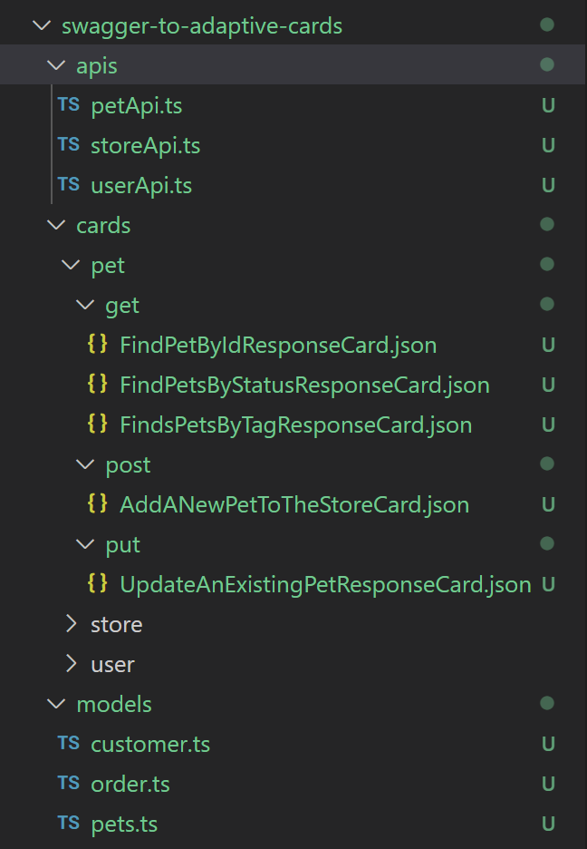

# Swagger to Adaptive Cards Project Structure

## Project structure

  
### apis folder
This folder contains code which is used to call backend service api.

### models folder
This folder contains some interface and data structure for different response type, and it is generated by components/schemas part inside swagger file. Below is an example yaml file to generate typescript interface file.

```yaml
components:
  schemas:
    Pet:
      required:
        - name
        - photoUrls
      properties:
        id:
          type: integer
          format: int64
          example: 10
        name:
          type: string
          example: doggie
        category:
          $ref: '#/components/schemas/Category'
        photoUrls:
          type: array
          xml:
            wrapped: true
          items:
            type: string
            xml:
              name: photoUrl
        tags:
          type: array
          xml:
            wrapped: true
          items:
            $ref: '#/components/schemas/Tag'
            xml:
              name: tag
        status:
          type: string
          description: pet status in the store
          enum:
            - available
            - pending
            - sold
      xml:
        name: pet
      type: object
```

->
```ts
export interface Pet {
    id?: number;
    name: string;
    category?: Category;
    photoUrls: Array<string>;
    tags?: Array<Tag>;
    status?: PetStatusEnum;
}

export enum PetStatusEnum {
    Available = 'available',
    Pending = 'pending',
    Sold = 'sold'
}
```

### cards folder
Cards folder contains adaptive cards for different apis. For example, there are 3 apis (pet, store, user), and each operation of an api contains several adaptive cards based on the swagger file.

```yaml
paths:
  /pet/{petId}:
    get:
      tags:
        - pet
      summary: Find pet by ID
      description: Returns a single pet
      operationId: getPetById
      parameters:
        - name: petId
          in: path
          description: ID of pet to return
          required: true
          schema:
            type: integer
            format: int64
      responses:
        '200':
          description: successful operation
          content:
            application/json:
              schema:
                $ref: '#/components/schemas/Pet'          
            application/xml:
              schema:
                $ref: '#/components/schemas/Pet'
        '400':
          description: Invalid ID supplied
        '404':
          description: Pet not found
```

->

```json
{
  "type": "AdaptiveCard",
  "body": [
      {
          "type": "TextBlock",
          "size": "Medium",
          "weight": "Bolder",
          "text": "Pet Information Card"
      },
      {
          "type": "ColumnSet",
          "columns": [
              {
                  "type": "Column",
                  "items": [
                      {
                          "type": "Image",
                          "style": "Person",
                          "url": "${photoUrls[0]}",
                          "size": "Medium"
                      }
                  ],
                  "width": "auto"
              },
              {
                  "type": "Column",
                  "items": [
                      {
                          "type": "TextBlock",
                          "weight": "Bolder",
                          "text": "Name: ${name}",
                          "wrap": true
                      },
                      {
                          "type": "TextBlock",
                          "spacing": "None",
                          "text": "Id: ${id}",
                          "isSubtle": true,
                          "wrap": true
                      },
                      {
                          "type": "TextBlock",
                          "spacing": "None",
                          "text": "Status: ${status}",
                          "isSubtle": true,
                          "wrap": true
                      },
                      {
                          "type": "TextBlock",
                          "spacing": "None",
                          "text": "Category: ${category.name}",
                          "isSubtle": true,
                          "wrap": true
                      }
                  ],
                  "width": "stretch"
              }
          ]
      }
  ],
  "$schema": "http://adaptivecards.io/schemas/adaptive-card.json",
  "version": "1.5"
}
```

## Open questions
- As discussed before, for get request, we can use command `get pet/1` to send request to bot and then bot will response an adaptive card for pet with id equals 1. And for post request, maybe there are many parameters in the request, so we need an adaptive card which help user compose the request. So to make it consistent, for get operation, do we need also generate get request adaptive card? For example, there are two adaptive cards for `FindPetById` api, one is `FindPetByIdRequestCard.json`, and another one is `FindPetByIdResponseCard.json`

## Appendix
Sample Swagger file:

https://github.com/swagger-api/swagger-petstore/blob/master/src/main/resources/openapi.yaml

